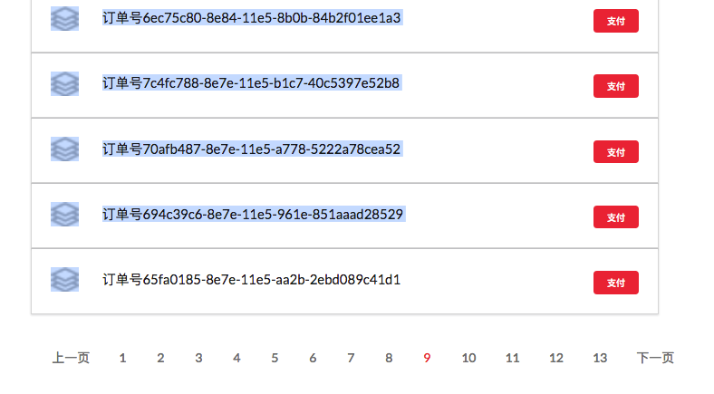

# angular-service
Wrap $http to handle service's 200 OK error response.
Wrap pagination data to handle pageState indicated pagination data.

# Contribution Notice:
Run `gulp` before making `git commit`. So the `dist` folder will be updated.

# Install
```
bower install angular-service
```

# Update 
```
bower update angular-service
```

# Basic Usage
```jade
script(src="#{cdn.normal}bower_components/angular/angular.min.js?#{cdn.version}")
script(src="#{cdn.normal}bower_components/angular-service/dist/scripts/all.js?#{cdn.version}")

script.
    angular.module('yourModule', ['servicesModule'])
        .controller('yourCtrl', ['service', function(service){
            service.get('xxx', {}).then(success, fail);
        }])
    ;

```

# Pagination Usage
There are 2 kinds of pagination:
    - pagination2: data was stored in cassandra or the same type of database, fetched by pageState, don't know the total records ahead of time 
    - pagination-total: data was stored in solr or the same type of database, fetched by offset, and you can get the total records ahead of time
    
1. pagination2
**Screen shot:**


**jade/pug template (Still haven't been using jade/pug? Use it, and convert your existing html to jade/pug by this tool: http://html2pug.jijiyy.me/)**
```jade
div(ng-controller="yourCtrl")
    table.ui.single.line.table
        thead
            tr
                th 时间
                th 项目
                th 内容
        tbody
            tr(ng-repeat="record in yourDataRecords.records[yourDataRecords.pageIndex]")
                td
                    span {{record.createDate | date : 'yyyy年M月d日'}}
                    br
                    span {{record.createDate | date: 'hh:mm'}}
                td
                    div(ng-repeat="p in record.product") {{p.name}}
                td.ui.middle.aligned
                    span.middle.aligned {{record.type === 'I' ? '+' : (record.type === 'E' ? '-' : '')}}{{record.amount}}
        tfoot
            tr
                th(colspan="3")
                    include ../../public/bower_components/angular-service/views/pagination2.jade
                    + pagination2('yourDataRecords')
```
**javascript**
```javascript
angular.module('yourModule', ['servicesModule'])
    .controller('yourCtrl', ['$scope', 'service', 'paginationData', function ($scope, service, paginationData) {
        $scope.yourDataRecords = new paginationData('http://your/data/source/url');
        $scope.yourDataRecords.getNextPage();
    }])
    .controller('anotherCtrl', ['$scope', 'service', 'paginationData', function ($scope, service, paginationData) {
        $scope.yourDataRecords = new paginationData('http://your/data/source/url', {pageSize: 5});
        $scope.yourDataRecords.getNextPage();
    }])
    .controller('yetAnotherCtrl', ['$scope', 'service', 'paginationData', function ($scope, service, paginationData) {
        $scope.yourDataRecords = new paginationData('http://your/data/source/url');
        $scope.yourDataRecords.getNextPage({pageSize: 15});
    }])
;
```

2. pagination-total
**jade/pug template (Still haven't been using jade/pug? Use it, and convert your existing html to jade/pug by this tool: http://html2pug.jijiyy.me/)**
```jade
div(ng-controller="yourCtrl")
    table.ui.single.line.table
        thead
            tr
                th 时间
                th 项目
                th 内容
        tbody
            tr(ng-repeat="record in yourDataRecords.records[yourDataRecords.pageIndex]")
                td
                    span {{record.createDate | date : 'yyyy年M月d日'}}
                    br
                    span {{record.createDate | date: 'hh:mm'}}
                td
                    div(ng-repeat="p in record.product") {{p.name}}
                td.ui.middle.aligned
                    span.middle.aligned {{record.type === 'I' ? '+' : (record.type === 'E' ? '-' : '')}}{{record.amount}}
        tfoot
            tr
                th(colspan="3")
                    include ../../public/bower_components/angular-service/views/pagination-total.jade
                    + paginationTotal('yourDataRecords')
```
**javascript**
```javascript
angular.module('yourModule', ['servicesModule'])
    .controller('yourCtrl', ['$scope', 'service', 'paginationDataWithTotal', function ($scope, service, paginationDataWithTotal) {
        $scope.yourDataRecords = new paginationDataWithTotal('http://your/data/source/url');
        $scope.yourDataRecords.getNextPage();
    }])
    .controller('anotherCtrl', ['$scope', 'service', 'paginationDataWithTotal', function ($scope, service, paginationDataWithTotal) {
        $scope.yourDataRecords = new paginationDataWithTotal('http://your/data/source/url', {pageSize: 5});
        $scope.yourDataRecords.getNextPage();
    }])
    .controller('yetAnotherCtrl', ['$scope', 'service', 'paginationDataWithTotal', function ($scope, service, paginationDataWithTotal) {
        $scope.yourDataRecords = new paginationDataWithTotal('http://your/data/source/url');
        $scope.yourDataRecords.getNextPage({pageSize: 15});
    }])
;
```